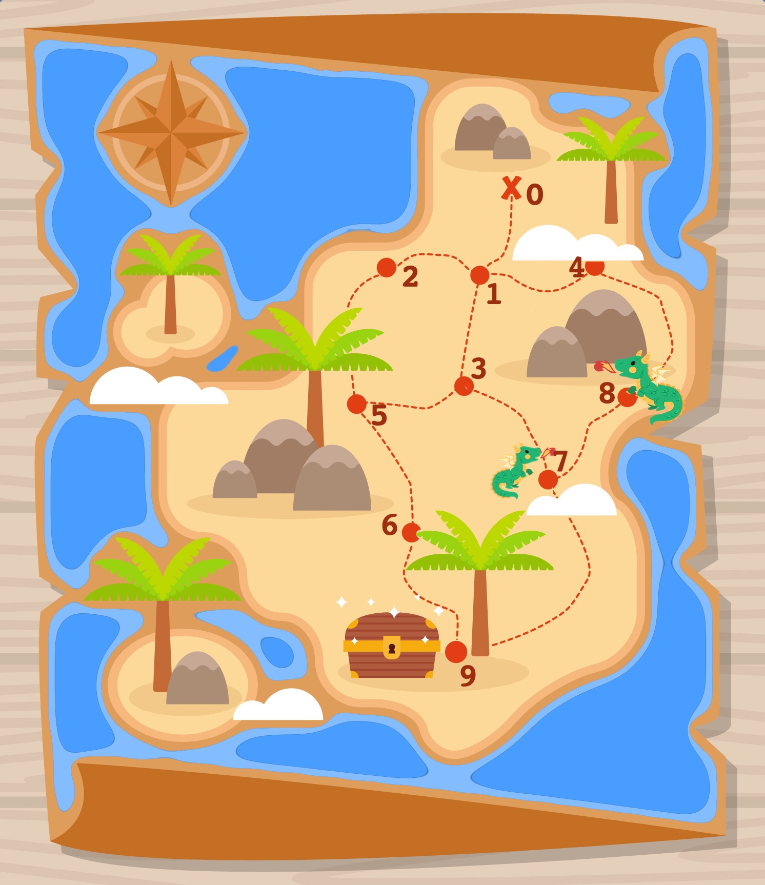
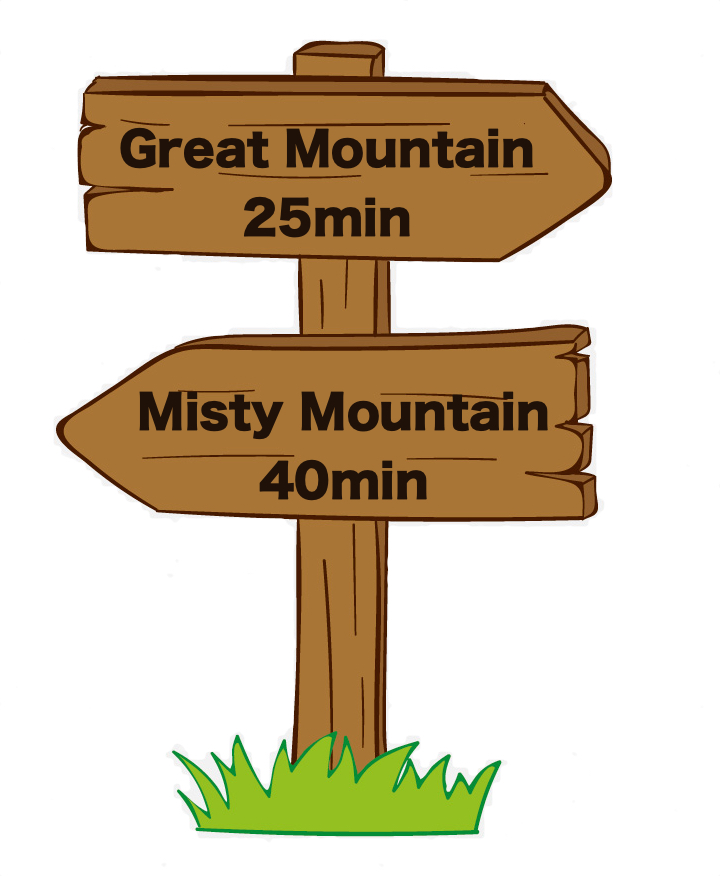

# Hunting treasures

You're spending your vacation on an island. 🏝️ Suddenly, you find a message in a bottle. You open the message: It's a treasure map!



## Task #1: Finding the treasure

You're quickly able to localize yourself on the map, starting on location `0`. Now that you have the map and know where you and the treasure are, you decide to go and try to find the treasure. 🚀

Can you find the fastest path to the treasure?

### I/O

The treasure map that is illustrated above has the following structure:

```python
1  # indicates whether treasure map is for task normal(1), dragon(2) or rivalry(3)
0  # your location (node_id)
9  # location of the treasure (node_id)
[(0,1),(1,2),(1,3),(1,4),(2,5),(3,5),(3,7),(4,8),(5,6),(6,9),(7,8),(7,9)]  # roads (node_A, node_B): each pair represents a road connecting two nodes
```

Walking along a road always takes you 5min. Your solution should return a list with the node IDs of the nodes you're passing when taking the fastest way. The solution here would be:

```python
[0, 1, 3, 7, 9]
```


## Task #2: Dealing with Dragons

There are also several dragons living on the island. They're usually peaceful but every 15min they have to sneeze. Every time they sneeze, they accidentally breathe fire. Dragons only live on nodes and your treasure map also tells you where they live. In our example, there are two dragons living on the nodes `7` and `8`.

To not get harmed, you should definitely avoid nodes where dragons live when they have to sneeze.

Additional info:

- Travelling on a road always takes you 5minutes.
- When you start your journey, all dragons have just finished sneezing.
- Every node is very crowded, busy and touristy so you don't want to rest and wait at nodes. You always choose a next road when you arrive at a node.
- When you start traveling on a road, you continue till you reach the next node. You cannot start and then turn around and go back while on a road.

Can you find the fastest, safe path to the treasure?

### I/O

The treasure map that is illustrated above has the following structure:

```python
2  # indicates whether treasure map is for task normal(1), dragon(2) or rivalry(3)
0  # your location (node_id)
9  # location of the treasure (node_id)
[(0,1),(1,2),(1,3),(1,4),(2,5),(3,5),(3,7),(4,8),(5,6),(6,9),(7,8),(7,9)]  # roads (node_A, node_B): each pair represents a road connecting two nodes
[7,8] # nodes where dragons are living
```

Your solution should return a list with the node IDs of the nodes you're passing when taking the fastest way without taking the risk of being on a road when the dragon is sneezing. The solution here would be:

```python
[0, 1, 2, 5, 6, 9]
```


## Task #3: Unwanted Competition

_[For this task, assume that there are no dragons. You can also solve this part of the challenge even if you got stuck on task #2 avoiding dragons. Also note that the following task uses a different treasure map as an example than the previous tasks.]_

With great shock you learn that your mean neighbour is on the same island, being on vacation as well! He suprises you and steals your treasure map.

Luckily, you have already memorized the map and decide to try to find the treasure anyways! But when doing so, you don't want to risk any chance of meeting your neighbour on any road.

Additional info:

- You are certain your neighbour is going to pick the shortest route to the treasure.
- You don't know how fast your neighbour travels.
- It's ok to meet your neighbour at nodes but you don't want to meet the neighbour on roads.

Can you find the fastest path to the treasure without running risk of meeting your neighbour on a road?

### I/O

_(attn. this example is not same map as the example in the image)_

The treasure map that is illustrated above has the following structure:

```python
3  # indicates whether treasure map is for task normal(1), dragon(2) or rivalry(3)
0  # your location (node_id)
8  # location of the treasure (node_id)
[(0,1),(0,2),(0,3),(1,4),(2,4),(2,6),(3,7),(4,5),(5,8),(6,7),(6,8)]  # roads (node_A, node_B): each pair represents a road connecting two nodes
```

Your solution should return a list with the node IDs of the nodes you're passing when taking the fastest way that does not share a road with the path you're neighbour is taking. The solution of this example here would be:

```python
[0, 1, 4, 5, 8]
```

## Task #4: Helpful Signposts

On the island, there are two very famous mountains: the Great and the Misty Mountain. Because they're both so popular, every node on the island has a signpost indicating the time it takes to hike to the mountains. These signposts are also written on the treasure maps.



It is not needed to implement a solution for this. Instead, we'd like to hear from you whether the information on these signposts can be used to find the fastest path to the treasure. The treasure maps do not change and the location of the mountains might be completely unrelated to the location of the treasure map which means the treasure does not need to be located at one of the mountains. You only have additional signpost information on the treasure maps. How can these signposts help you and why? Lay out steps on how you would use them.

You can write your thoughts into the `README` file.

## Solving this challenge

### Example Tests and a Python helper

Included in this challenge is a python script that reads a file with test examples. The script also compares the correct solution with a given one. You are free to use that script, integrate your solution and run the file. The places where you need to make adjustments are marked with `[TODO]`.

You can then run the file with

```bash
python pathfinder.py treasure_maps.txt
```

The structure of the example tests in `treasure_maps.txt` is an arbitrarily long list of map descriptions as follows:

```python
--- # This line can be ignored
1  # indicates whether treasure map is for task normal(1), dragon(2) or rivalry(3)
0  # your location (node_id)
9  # location of the treasure (node_id)
[(0,1),(1,2),(1,3),(1,4),(2,5),(3,5),(3,7),(4,8),(5,6),(6,9),(7,8),(7,9)]  # roads (node_A, node_B): each pair represents a road connecting two nodes
[[0, 1, 3, 7, 9]] # list of possible solutions
```

Feel free to extend the test cases.

Using these helpers are **not a must** and is meant to help you if you want. You are free to use any other programming language as well.

### Expected Solution

When looking at your solution, we care about these qualities in this priority:

1. correctness
2. maintainability/readability
3. performance

For maintainability we also include of how easy it would be to on-board someone new to your code base. Your `README` is one of the documents that we will check.

There are two ways you can write your solution. Either use our file `pathfinder.py` and make sure it runs with

```
python pathfinder.py treasure_maps.txt
```

Or include a solution that can read a text file `in.txt` with a description of a treasure map as described in the I/O section as an input parameter and writes your solution to an output file `out.txt`:

```
./your_solver in.txt out.txt
```

Let us know in a `README` file how to correctly use your programme. We will test your solution on a Macbook running macOS Mojave. If you suspect that your solution might be hardware dependent, let us know and make sure it runs correctly on Ubuntu 16.04. You can use use a docker image to test it with

```bash
# get image
docker pull ubuntu:16.04`.
# start a container mounted to your directory
docker run -it --entrypoint=/bin/bash -v $(pwd)/your_dir:/your_dir ubuntu:16.04
# now run your programm within the container

```

### Time

We value your time. There is no hard time limit but we expect you to spend about 2-4 hours on this challenge. If you end up using too much time for solving the task, don't continue until you got everything right. Instead, send us what you have and include thoughts on how you would continue on the tasks. The purpose of this challenge is to evaluate how you approach and solve a problem. We want to see whether you are a good fit to our team and whether we're able to discuss with you how you would continue on a given task and what resources you would need to succeed.


Don't hesitate to contact us if you have any question! Good luck and thank you for yout time!